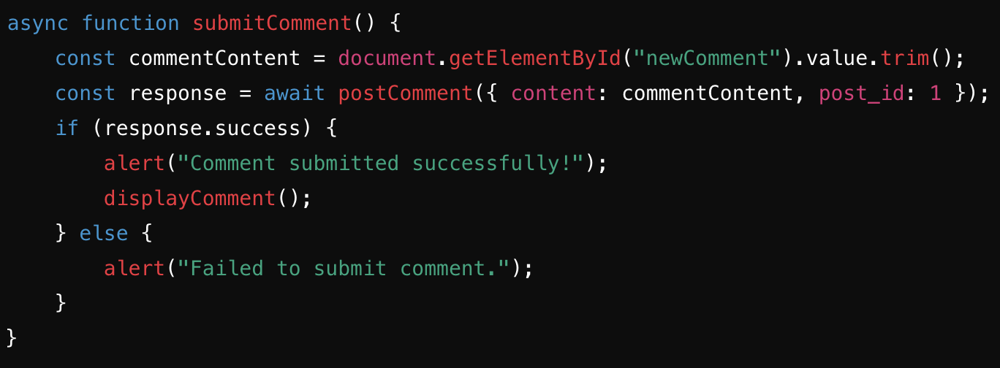

<nav>
  <ul>
    <li><a href="/jackson_2025/Legendary">Review</a></li>
    <li><a href="/jackson_2025/NATM">N@TM</a></li>
    <li><a href="/jackson_2025/Feature">Feature</a></li>
    <li><a href="/jackson_2025/Achievement1">Achievement 1</a></li>
    <li><a href="/jackson_2025/Achievement2">Achievement 2</a></li>
    <li><a href="/jackson_2025/Achievement3">Achievement 3</a></li>
    <li><a href="/jackson_2025/Achievement4">Achievement 4</a></li>
    <li><a href="/jackson_2025/Achievement5">Achievement 5</a></li>
    <li><a href="/jackson_2025/SelfGrade">Self Grade</a></li>
    <li><a href="/jackson_2025/Extra">Extra</a></li>
    <li><a href="/jackson_2025/MCQ">MCQ</a></li>
    <li><a href="/jackson_2025/PPR">PPR</a></li>
  </ul>
</nav>

# **CPT BLOG - Comments of Car Posts**

AP Computer Science Principles: Comments Feature Blog  

Programming is a collaborative and creative process that brings ideas to life through software development. For my AP Computer Science Principles project, my team and I created a **Car Social Media Website**, where users can share and interact with posts about their favorite cars. My individual feature focuses on implementing a **comments system** that enhances user interaction and engagement. Below, I will detail the purpose, design, and functionality of my feature, tying it to the learning objectives and demonstrating its implementation across the frontend, backend, and database.

## **Purpose of the Feature**
The purpose of our **Car Social Media Website** is to create a platform where car enthusiasts can connect and share their passion. My individual feature, the **comments system**, allows users to:  
- **Post comments** on car posts.  
- **View comments** to engage in discussions.  
- **Edit their comments** to refine their input.  
- **Delete comments** when necessary.  

This feature solves the problem of limited interaction by fostering community engagement and personal expression. It enables innovation and creativity while exploring user interests.

## **Input and Output**
The comments system involves the following inputs and outputs:  
- **Input:** Users enter their comments in a text box on the frontend, and this input is sent as a JSON payload (e.g., `content` and `post_id`) to the backend API.  
- **Output:** The API returns JSON responses containing the comment data (e.g., `content`, `user ID`, `post ID`, and `date posted`). The frontend dynamically displays the comments using this data.  

## **Full Stack Demonstration**
The frontend, built with HTML, CSS, and JavaScript, provides a clean interface for users to interact with the comments system. Users can submit comments, view all comments, and edit or delete their own comments. When a user writes a comment and clicks "Submit Comment," the frontend sends a `POST` request to the backend API.  

To handle comment submissions, the JavaScript function looks like this:

The backend, built using Flask, supports CRUD operations for comments:
- **GET:** Retrieve all comments.  
- **POST:** Add a new comment.  
- **PUT:** Update an existing comment.  
- **DELETE:** Remove a comment.  

The `POST` endpoint processes new comments like this:

Error handling is managed with conditional checks for required fields:

The `CarComments` database model, defined using SQLAlchemy, manages the comment data structure. It includes methods to create, read, update, and delete comments.

## **Algorithms and Data Handling**
The feature involves several algorithmic processes:  
- **Sequencing:** Each request follows a structured sequence from input validation to database interaction and API response.  
- **Selection:** Conditional checks (e.g., missing fields) determine error handling or processing.  
- **Iteration:** Loops iterate through lists of comments to format and display them.

The backend uses SQLAlchemy to retrieve and format comments like this:

On the frontend, API calls are handled and responses are displayed dynamically. The function to fetch and display comments looks like this:

## **Conclusion**
The comments feature enhances the Car Social Media Website by enabling users to share opinions, engage with others, and manage their content. Through the integration of frontend, backend, and database components, the feature demonstrates the collaborative and creative nature of programming. By solving the problem of limited user interaction, it fosters community engagement and provides a platform for creative expression.

